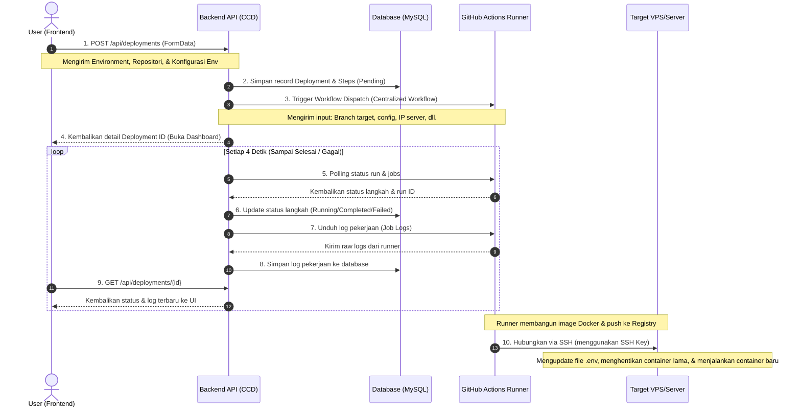

# Alur Logika Proses Deployment (Deployment Flow Logic)

Dokumen ini menjelaskan alur logika proses deployment di aplikasi **Control Center Deployments (CCD)**, mulai dari interaksi pengguna di frontend, pemrosesan di backend, eksekusi pipeline di GitHub Actions, hingga pembaruan container di VPS/Server target.

---

## 📊 Diagram Alur (Sequence Diagram)

---

## ⚙️ Detail Tahapan Proses

### 1. Tahap Inisiasi (Frontend Wizard)
* Pengguna memilih **Target Environment** (Staging/Production) dan **Aplikasi/Repositori** yang ingin dideploy.
* Sistem memvalidasi apakah repositori memiliki branch target yang sesuai (Staging/Production branch). Jika tidak ada, sistem menampilkan peringatan dan menggunakan default branch sebagai fallback.
* Pengguna menyesuaikan variabel konfigurasi (`.env`) untuk masing-masing repositori.
* Pengguna menekan tombol **Execute Deployment**.

### 2. Pembuatan Deployment & Pemicuan (Backend)
* Backend menerima request, menyimpan data deployment baru dengan status `pending`, serta membuat 6 langkah default pipeline:
  1. **Triggering Pipeline** (Pemicuan)
  2. **Pulling Code** (Checkout code)
  3. **Building Image** (Docker build)
  4. **Pushing Image** (Docker push ke registry)
  5. **Configuring Server** (Konfigurasi SSH & .env di server target)
  6. **Deploying Container** (Docker run / Docker compose up di server target)
* Backend memicu API GitHub Actions (**Workflow Dispatch**) pada repositori central-deployer (`control-center-deployments`) untuk memulai workflow.
* Data input yang dikirim ke GitHub Actions meliputi:
  * URL repositori target & branch/ref target.
  * Alamat host/IP & username SSH server target.
  * Nama file Dockerfile.
  * **Config JSON**: gabungan seluruh variabel `.env` yang diisi oleh user.
  * **Secret Suffix**: penentu SSH Key mana yang akan digunakan di GitHub Secrets (`STAGING` atau `PRODUCTION`).

### 3. Eksekusi Workflow di GitHub Runner
* Runner GitHub Actions mengambil kode repositori target menggunakan token akses.
* Runner membangun (*build*) image Docker aplikasi.
* Runner mengunggah (*push*) image Docker tersebut ke Docker Hub.
* Runner masuk ke VPS target menggunakan koneksi SSH untuk menyiapkan direktori deployment, memperbarui file `.env`, menghentikan container lama, dan menyalakan container baru (menggunakan image terbaru dari registry).

### 4. Sinkronisasi Log & Status (Polling Backend)
* Sembari GitHub runner bekerja, backend CCD menjalankan timer **polling interval setiap 4 detik** untuk memantau aktivitas pekerjaan di GitHub.
* Backend mencocokkan status langkah-langkah di GitHub Actions dengan database CCD:
  * Status tiap langkah yang berubah di GitHub disinkronkan ke tabel `deployment_steps` di database.
  * Log pekerjaan (*job logs*) dari GitHub disalin secara real-time ke kolom `log` tabel `deployments`.
  * Jika salah satu langkah atau workflow mengalami kegagalan (`failure`, `cancelled`, atau `timed_out`), backend langsung menghentikan polling dan menandai seluruh sisa langkah sebagai `failed`.
* Frontend melakukan request berkala ke backend untuk memperbarui visual grafik alur dan baris log di dashboard secara real-time.

### 5. Penanganan Error (Error Handling) & Retry
* **Deteksi Kegagalan Instan**: Begitu ada langkah yang gagal, backend langsung menghentikan timer polling dan mematikan eksekusi status steps yang tersisa, menetapkannya langsung ke `failed`.
* **Respon Cepat UI**: Frontend mendeteksi kegagalan tersebut, menghentikan seluruh animasi aliran garis koneksi SVG, mengubah indikator menjadi warna merah (failed), dan langsung memunculkan tombol **"Try Again"** (Coba Lagi).
* **Mekanisme Ulang (Retry)**: Ketika tombol **Try Again** ditekan, sistem akan menghancurkan data langkah lama, menyetel status deployment kembali ke `pending`, dan mengulang pemicuan workflow dari langkah pertama.

---

## 🔑 Logika Pencocokan SSH Key Secrets
CCD menggunakan logika pencocokan rahasia (*secrets*) yang cerdas berdasarkan target branch environment untuk menyederhanakan konfigurasi SSH di GitHub Secrets:

* Suffix ditentukan dari kolom **`target_branch`** milik target environment:
  * Jika target branch-nya adalah **`main`**, maka suffix-nya adalah **`PRODUCTION`** (workflow akan membaca secret **`SSH_KEY_PRODUCTION`**).
  * Jika target branch-nya adalah selain `main` (seperti **`staging`**, **`dev`**, dll), maka suffix-nya adalah **`STAGING`** (workflow akan membaca secret **`SSH_KEY_STAGING`**).
* Dengan pendekatan ini, Anda cukup mendaftarkan 2 secret utama (`SSH_KEY_STAGING` dan `SSH_KEY_PRODUCTION`) di repositori GitHub, tidak peduli seberapa banyak environment yang Anda miliki.
